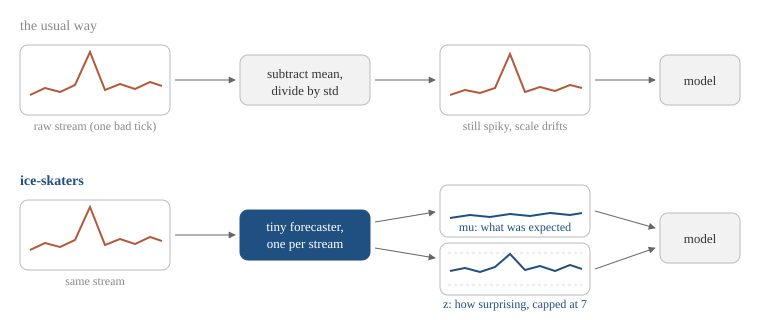

# ice-skaters ([docs](https://ice-skaters.microprediction.org))

[skaters](https://github.com/microprediction/skaters) on a
[river](https://riverml.xyz): calibrated forecast features for streaming
machine learning, in Python and in the browser.

[Live demo](https://ice-skaters.microprediction.org/demos/)
&middot; [The paper](papers/ice-skaters-jss.pdf)

## The idea, from zero

Suppose data arrives one row at a time and a model must predict, then
learn, then move to the next row: sensor readings, poll numbers, prices,
counts. That is streaming machine learning, and
[river](https://riverml.xyz) is the standard Python library for it. The
usual hygiene is to standardize each number on the fly, subtracting a
running mean and dividing by a running deviation. That helps with scale
and nothing else: one fat-fingered reading still arrives at full force,
and worse, it poisons the running mean and deviation that every later
reading is judged by.

ice-skaters replaces that with a stronger contract. Every numeric stream
gets its own tiny online forecaster (from
[skaters](https://skaters.microprediction.org), a zero-dependency
forecasting library), and the model is handed the forecaster's two-number
summary instead of the raw value: the predictive mean, which is what the
forecaster expected this value to be, and the standardized surprise z,
which is how unexpected the actual value was, on a universal scale where
2 is notable, 4 is remarkable, and 7 cannot be exceeded by construction.
The mean carries the level. The z carries the news. A wild observation
can move the pair only so far, and that bounded influence is where the
robustness comes from.



## Install and use

```
pip install ice-skaters
```

```python
from river import datasets, linear_model, metrics, preprocessing
from ice_skaters import LaplaceFeatures, LaplaceTarget

model = LaplaceTarget(
    regressor=preprocessing.TargetStandardScaler(
        regressor=LaplaceFeatures()
        | preprocessing.StandardScaler()
        | linear_model.LinearRegression()))

mae = metrics.MAE()
for x, y in datasets.TrumpApproval():
    pred = model.predict_one(x)
    mae.update(y, pred if pred is not None else 0.0)
    model.learn_one(x, y)
```

`LaplaceFeatures` is a river transformer that does the two-number
substitution for the input streams. `LaplaceTarget` wraps any regressor,
in the style of `TargetStandardScaler`, to add the target's own pair,
which a transformer cannot do since it never sees the target; the target
itself stays raw. Both estimators pipe, pickle and deep-copy like any
river estimator. Non-numeric values pass through untouched, and NaN is
imputed by the forecast itself with z = 0: the model receives "expected
value, no news" instead of a poisoned pipeline.

**If you adopt one thing, adopt the wrapper.** In the ablation,
`LaplaceTarget` alone, with raw features untouched, beat river's
recommended pipeline on three of four of river's own datasets untouched,
won 10/10 under simulated feature contamination, and tied the fourth.
Add `LaplaceFeatures` when you distrust the features themselves.

## What the evidence says

On TrumpApproval with river's recommended pipeline (progressive
validation MAE, burn-in 100, `examples/trump_approval.py`):

| | clean | 2% corrupted readings |
|---|---|---|
| `StandardScaler` pipeline | 0.328 | 0.597 |
| + Laplace front-end | 0.382 | 0.407 |

The front-end pays a small toll on clean data and holds its footing when
the inputs misbehave. In controlled simulation the same substitution
beats raw features, a running z-score, a median/MAD winsorizer and a
Huberised loss 30/30 seeds under every contamination type tested. There
is also a theorem: pathwise regret transfer with measured constants and
no calibration assumption, proofs and a numerical bound check in
[papers/regret-transfer.md](papers/regret-transfer.md), and the full
write-up in [papers/ice-skaters-jss.pdf](papers/ice-skaters-jss.pdf).
Protocols, harnesses and the losing rows live in the
[timemachines](https://github.com/microprediction/timemachines) repo,
`benchmarks/RESULTS.md` section 6.

Cost, measured: about 390 microseconds per stream per sample, roughly
900x `StandardScaler`. Right for polls, sensors, market bars and anything
at human timescales; wrong inside a hot path at hundreds of thousands of
ticks per second.

## Boundaries, stated plainly

- Distance-based learners (KNN) do not benefit: neighbour averaging is
  already spike-robust and the extra dimensions degrade the metric.
- Entity-interleaved streams (many units multiplexed into one key) want
  per-entity forecasters; a single forecaster per key is handicapped.
- If your heavy tails are signal rather than noise, taming them costs
  accuracy. Whether the extremes are informative decides the coordinates.

## JavaScript

The same construction runs in the browser with no build step and no
dependencies: `docs/js/ice-skaters/index.mjs` ports the river pieces the
study used (StandardScaler, TargetStandardScaler, LinearRegression and
the Pipeline learn-then-transform semantics, line for line, parity-tested
against Python to 1e-9) on top of the vendored skaters JavaScript twin.
The [live demo](https://ice-skaters.microprediction.org/demos/) is a
stream, two models and a fat-finger button, all client-side.

## Relation to the stack

`skaters` does one thing: fast univariate distributional forecasting,
stdlib-only, in Python or the browser. `timemachines` builds anomaly
detection on the same calibrated surprise streams. ice-skaters is the
bridge from those streams to river's estimator protocol, and nothing
more.
